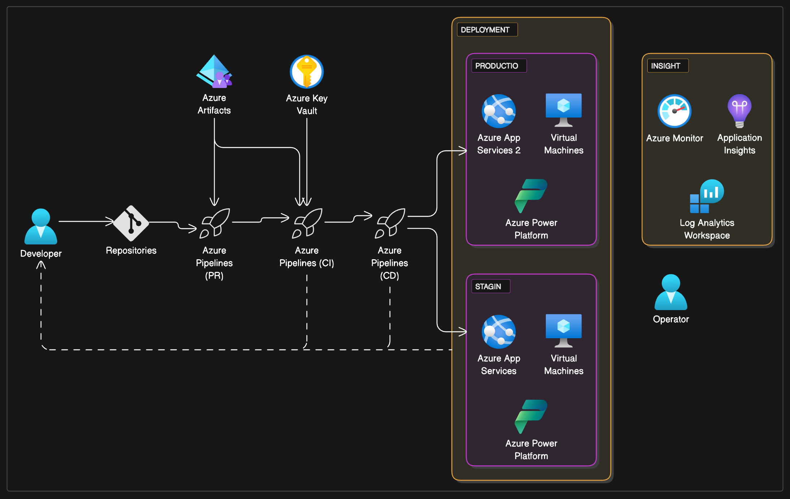

Drop a folder inside `blogs/` with an `index.md` file. Run `npm run build`. That's it.

## Frontmatter

Every post begins with a YAML block:

```yaml
---
title: My Post Title
date: 2026-01-15
description: One-sentence summary shown on the post list.
tags: [javascript, tutorial]
---
```

`title` and `date` are required. `description` and `tags` are optional.

## Text formatting

You can write **bold**, *italic*, ~~strikethrough~~, and `inline code`.

> Blockquotes stand out with a coloured left border and a subtle background.
> They're great for quotes or callout notes.

## Links

[Links](https://example.com) get an underline on hover. Internal links work the same way — just use a relative path.

## Lists

Unordered:

- Item one
- Item two
  - Nested item
- Item three

Ordered:

1. First step
2. Second step
3. Third step

Task list:

- [x] Write a post
- [x] Push to deploy
- [ ] Share with the world

## Code

Fenced code blocks get syntax highlighting:

```javascript
async function fetchPost(slug) {
  const res = await fetch(`/api/posts/${slug}`);
  if (!res.ok) throw new Error('Not found');
  return res.json();
}
```

```python
def slugify(text: str) -> str:
    return re.sub(r'\s+', '-', text.lower().strip())
```

```bash
npm run build
# → dist/ is ready to deploy
```

## Tables

| Feature       | Supported |
|---------------|-----------|
| Syntax highlighting | ✓ |
| Dark / light toggle | ✓ |
| Per-post asset folder | ✓ |
| Auto deploy (CF Pages) | ✓ |

## Images

Place images in the same folder as your post and reference them with a relative path.
The alt text becomes the caption:

```markdown

```

## Headings auto-generate anchor links

Hover any heading to see the `#` anchor. Link directly to a section like `/blog/getting-started/#code`.

## What's next

Add a new post by creating `blogs/my-topic/index.md`. Any files alongside it
(images, diagrams, PDFs) are copied to `dist/` automatically.
