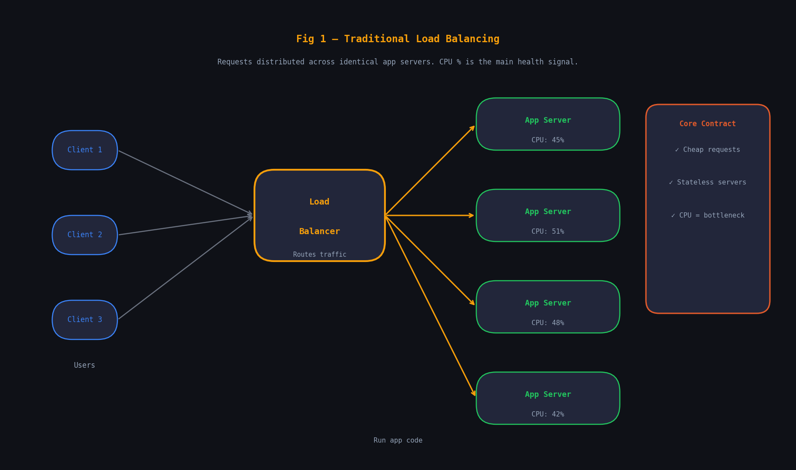
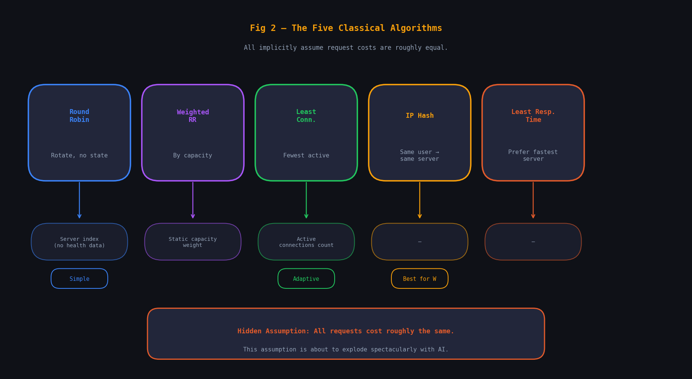
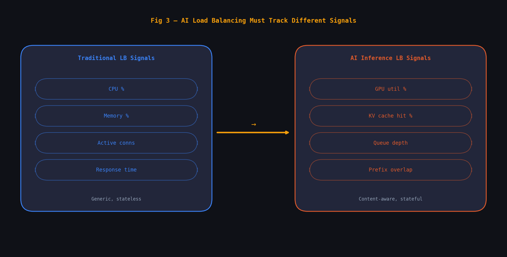
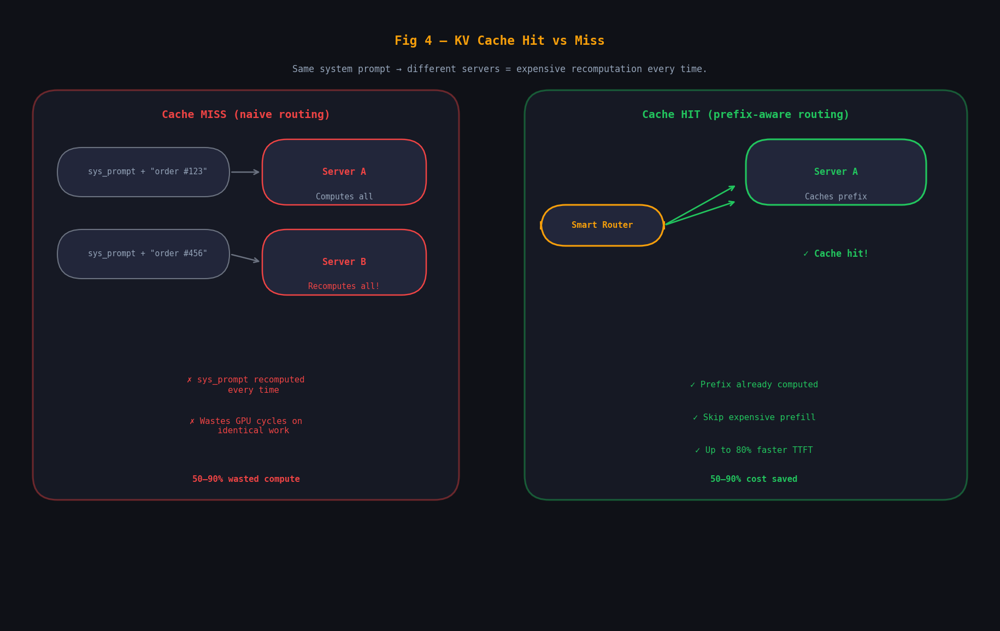
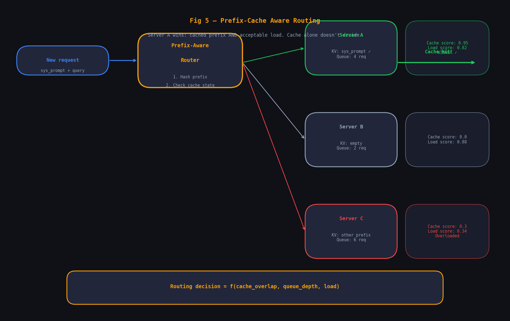
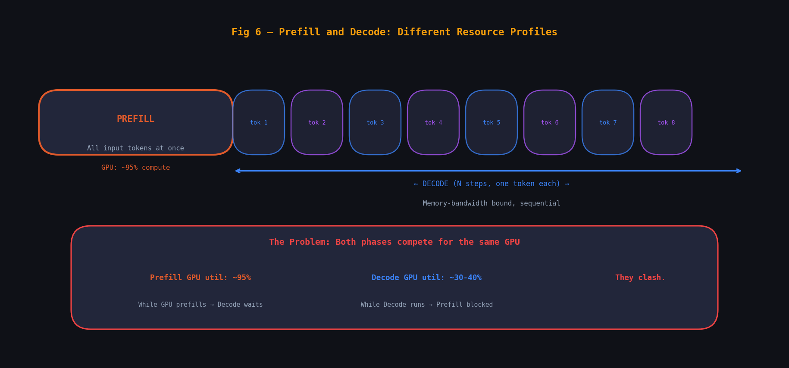
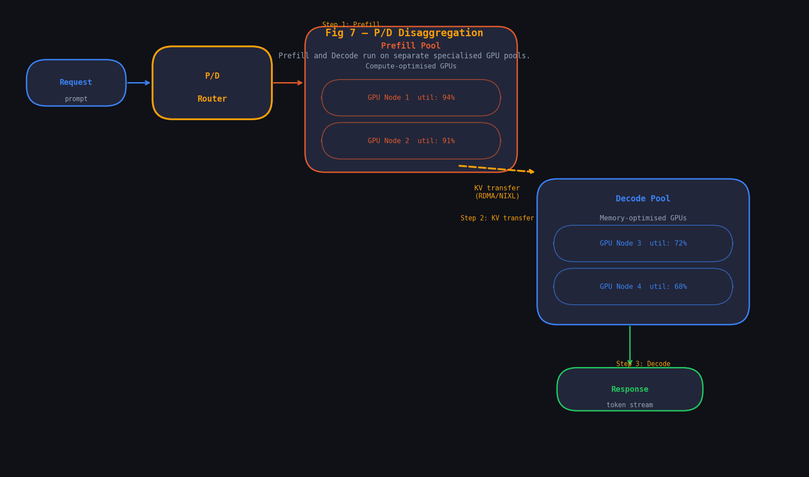
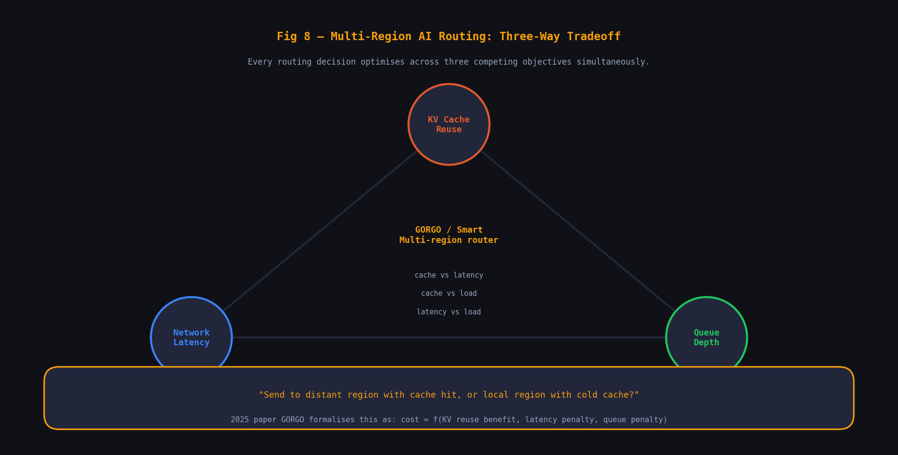
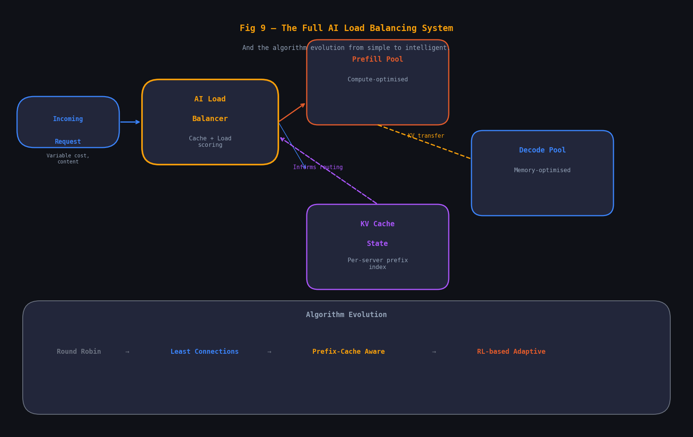

From round-robin to KV-cache-aware routing — how AI broke every assumption traditional load balancing was built on.

---

## Contents

1. [The Problem Load Balancing Was Born to Solve](#the-problem-load-balancing-was-born-to-solve)
2. [Traditional Algorithms — The Classic Toolkit](#traditional-algorithms--the-classic-toolkit)
3. [When AI Entered the Room](#when-ai-entered-the-room)
4. [KV Cache — The New "State" in Stateless Systems](#kv-cache--the-new-state-in-stateless-systems)
5. [Prefix-Cache Aware Routing — The New Algorithm](#prefix-cache-aware-routing--the-new-algorithm)
6. [Prefill / Decode Disaggregation — AI's Unique Architecture](#prefill--decode-disaggregation--ais-unique-architecture)
7. [Multi-Region AI Load Balancing](#multi-region-ai-load-balancing)
8. [The Full Comparison — Traditional vs AI](#the-full-comparison--traditional-vs-ai)
9. [What to Remember](#what-to-remember)

---

## The Problem Load Balancing Was Born to Solve

Imagine you run a bank with one teller. On Monday morning, 400 customers show up. The queue stretches out the door. People leave. Your one teller burns out. The bank fails.

Now imagine 20 tellers, but a broken queue system that sends everyone to Teller #3. Same problem. The answer isn't just *more servers* — it's smart distribution of work across those servers. That's load balancing.

In traditional web architecture, load balancing sits between the client (browser, mobile app) and your fleet of application servers. Every HTTP request that comes in gets routed to one server in the fleet. The goal: no single server gets overwhelmed, latency stays low, and if one server dies, others absorb its load.



Three things are true about this setup that we'll want to remember, because AI will break all three of them:

**1. Requests are roughly the same cost.** A `GET /users` and a `POST /orders` are different endpoints, but they both execute in a few hundred milliseconds, and the variance is small. The load balancer can treat them as interchangeable units of work.

**2. Servers are stateless.** Any server can handle any request. There's no history it needs from a previous request (session state is pushed to Redis or a DB). This is the fundamental property that makes load balancing work — you can freely spray requests anywhere.

**3. The key resource is CPU.** Load balancers watch CPU utilisation, active connections, and response times. These are the signals that tell you a server is struggling.

> **The Core Contract:** Traditional load balancing works because requests are **cheap, stateless, and homogeneous**. Route anywhere. All servers are equal. CPU is the bottleneck. AI will destroy every one of these assumptions.

---

## Traditional Algorithms — The Classic Toolkit

Before we talk about what changed, let's walk through the algorithms that have served us well for decades. These are the classics. They still work beautifully for web apps today.

### Round Robin

The simplest possible algorithm. Server 1, Server 2, Server 3, Server 4, Server 1, Server 2… Requests are distributed in a fixed circular order. No state, no intelligence, just turn-taking.

**When it works:** Homogeneous servers, homogeneous request costs, no session affinity needed.

**When it fails:** If Server 3 is slightly slower (older hardware), it gets the same share but falls behind. Requests pile up at the slowest node.

### Weighted Round Robin

Assigns a weight to each server based on capacity. A server with weight 3 gets 3× as many requests as one with weight 1. Solves the hardware heterogeneity problem.

### Least Connections

Route each new request to the server with the fewest *active* connections right now. If one server is handling 100 connections and another has 40, the next request goes to the 40-connection server.

This is smarter than Round Robin because it adapts to actual server load in real-time, not just a static rotation.

### IP Hash (Sticky Sessions)

Hash the client's IP address to always send them to the same server. This is how you get "stickiness" — the same user hits the same server every time. Useful when you need to cache something locally on the server for that user.

### Least Response Time

Track how long each server is taking to respond, and prefer faster servers. Actively favours healthy, low-latency nodes. Needs a health monitoring layer to function.



> **The Hidden Assumption:** Every one of these algorithms assumes that a request arriving at Server A will cost approximately the same as the same request at Server B. It's baked into their design. This assumption is about to explode spectacularly.

---

## When AI Entered the Room

Let's say you're an infrastructure engineer at a company that just launched an AI assistant. Your load balancer routes incoming requests to a fleet of "inference servers" — machines running the AI model. Round Robin. Simple. You've done this a thousand times.

Day one goes fine. Day two, you notice something disturbing. Some requests are taking 400ms. Others are taking 40 seconds. Same endpoint. Same servers. Completely different cost.

You look at the logs. A 400ms request was someone asking "What's 2+2?" — a 10-token output. The 40-second request was someone asking the model to summarise a 50,000-word document and produce a detailed analysis — 2,000 tokens of output, one at a time, autoregressively.

**These two requests hit the same endpoint but consumed 100× different amounts of compute.** Your Round Robin load balancer had no idea. It just… sent them.

| Signal | Value |
| --- | --- |
| Variance in request cost | up to 100× based on prompt/output length |
| GPU wasted with naive routing | ~40% |
| GPUs OpenAI uses to serve ChatGPT daily | 128K+ |

### But wait — what even is an "inference server"?

> **New Concept · Inference Server**
>
> An **inference server** is a machine (or cluster) that runs a trained AI model and responds to prediction requests. Think of it like an app server, but instead of executing business logic, it runs a neural network. Popular ones: **vLLM**, **TensorRT-LLM**, NVIDIA Triton, SGLang.
>
> The "weight" of the model (the parameters) sits in GPU memory (called HBM — High Bandwidth Memory). Each inference costs GPU compute and memory. Unlike a CPU web server where you can spawn many threads cheaply, GPU compute is precious and expensive.

So now you have a fleet of GPU inference servers, each holding a copy of the model. A load balancer distributes requests across them. But the assumptions are shattered:

- ❌ **Requests are NOT the same cost.** A 5-token response and a 2,000-token response are vastly different in compute, memory, and time.
- ❌ **Servers are NOT stateless.** Each GPU holds a cache of recently computed work — throw that away with naive routing and you re-do expensive computation constantly.
- ❌ **CPU is NOT the bottleneck.** GPU utilisation, GPU memory (HBM), and a completely new resource — the KV Cache — are what you need to watch.



---

## KV Cache — The New "State" in Stateless Systems

This is the concept that changes everything. If you understand the KV cache, the new load balancing algorithms will make perfect sense.

> **New Concept · KV Cache (Key-Value Cache)**
>
> When a language model processes a prompt, it must compute a mathematical representation (called **Key-Value tensors**) for every token. This computation is expensive. The KV cache is where the server stores these computed representations so they don't have to be recomputed if the same prefix appears again. Think of it as a memo table for AI computation. It lives in GPU memory and gets evicted under memory pressure.

Here's where it gets architectural. Almost every AI product uses a **system prompt** — a large block of instructions that appears at the start of every conversation. For example:

```
// System prompt (same for all users, 800 tokens)
"You are a helpful customer service agent for AcmeCorp. You handle returns, billing
queries, and shipping issues. Our return policy is 30 days..."

// User message (unique per conversation)
"Hi! I ordered something 15 days ago and it hasn't arrived yet."
```

Those 800 tokens of system prompt are *identical for every single user*. Computing their KV representation once and caching it — vs. recomputing it for each of the 10,000 requests per second you're handling — is the difference between a viable product and a bankruptcy.



> **The Key Insight:** Prompt caching can reduce Time to First Token (TTFT) by up to **80%** and cut compute costs by **50–90%**. But these gains only materialise if the request lands on the server that already has the prefix cached. With naive round-robin across N servers, the probability of a cache hit is only **1/N**. The cache gains evaporate as your fleet grows.

---

## Prefix-Cache Aware Routing — The New Algorithm

The insight from the previous chapter leads directly to the most important new load balancing algorithm in AI: Prefix-Cache Aware Routing.

The idea: *instead of routing by server load alone, also route by content.* Inspect the request's prefix (the shared beginning — usually the system prompt and/or conversation history), hash it, and try to route it to the server most likely to have that prefix already cached in its KV store.

### How it works in practice

When a new request arrives, the router computes a fingerprint of its prefix tokens. It then asks: "Which server has the highest overlap with this prefix in its KV cache?" The server with the most overlap wins the routing decision — with a caveat.

> **The Tension — Cache Affinity vs Load Balance**
>
> If you always route similar queries to the same server for cache hits, you may overload that server while others sit idle. The router must balance **cache locality** (route to the server that already has the prefix) against **load distribution** (don't let any server get overloaded). This is an active research problem.



### The numbers that justify this complexity

Precise prefix-cache-aware routing versus naive round-robin doesn't just improve latency — it achieves up to **108% improvement in throughput on the same hardware**. That means you can serve twice as many users without buying a single new GPU. That's a multi-million dollar difference at scale.

---

## Prefill / Decode Disaggregation — AI's Unique Architecture

Here's a concept with no equivalent in traditional web infrastructure. It's specific to generative AI, born from a fundamental property of how language models produce output.

> **New Concept · Prefill Phase**
>
> When an LLM receives a prompt, it must first process the entire input sequence at once — every token simultaneously. This is the **prefill** phase. It's compute-intensive (GPU running at near 100%), brief (happens once per request), and produces the KV cache for the input.

> **New Concept · Decode Phase**
>
> After prefill, the model generates the response *one token at a time*. Each step reads the entire KV cache from memory and produces a single new token. This is the **decode** phase. It's memory-bandwidth bound (not compute bound), sequential, and slow. A 2,000-token response requires 2,000 decode steps.



### The solution: give them separate GPU pools

The idea of Prefill-Decode Disaggregation (also called P/D disaggregation) is to run these two phases on separate, specialised GPU nodes. Prefill nodes are optimised for parallel compute. Decode nodes are optimised for memory bandwidth. A load balancer coordinates traffic between the two pools.



### But isn't transferring KV cache over the network slow?

Yes — and this is the core tradeoff. The technology that makes P/D disaggregation practical is **NIXL (NVIDIA Inference Xfer Library)**, which uses RDMA (Remote Direct Memory Access) to transfer KV tensors between GPUs at extremely high bandwidth, typically adding 50–200ms of network latency before the decode node can begin.

For long prompts (10,000+ tokens) where prefill would otherwise take seconds, this tradeoff is very much worth it. For short prompts under ~512 tokens, the overhead may outweigh the benefit.

### A lighter alternative: Chunked Prefill

> **New Concept · Chunked Prefill**
>
> Instead of processing a long prompt in one big blocking chunk, break the prefill into smaller fixed-size chunks (e.g., 8K tokens each) and *interleave* them with ongoing decode steps. A 32K-token document becomes 4 chunks, with decode steps running between chunks so decode is never fully blocked. Same GPU, no network transfer needed. Lower infrastructure overhead, slightly less optimal than full disaggregation for very long prompts.

---

## Multi-Region AI Load Balancing

Traditional multi-region load balancing is mostly about latency and availability. Route users to the nearest data centre. If one region goes down, failover to another. Requests are stateless so this is relatively straightforward.

For AI, multi-region introduces a three-way tradeoff that has no precedent in classic infrastructure. Every routing decision must now consider:

- **KV Cache Reuse** — route to the server with the cache hit
- **Network Latency** — route to the nearest region
- **Queue Depth** — avoid overloaded nodes



This is an open research problem. A 2025 paper called **GORGO** formalises it as minimising total serving cost = `f(KV cache reuse benefit, network latency penalty, queue wait penalty)`. The router picks the region/server that minimises this total cost function for each request.

---

## The Full Comparison — Traditional vs AI

Let's bring it all together. Here's what changes, dimension by dimension, when you move from load balancing web app servers to load balancing AI inference servers.

| Dimension | Traditional (App Server) | AI Inference |
| --- | --- | --- |
| Unit of work | HTTP request (10–200ms) | Token generation (ms to minutes, unpredictable) |
| Cost homogeneity | Roughly uniform | Varies 100× based on prompt/output length |
| Statefulness | Stateless (session → Redis) | KV cache creates implicit server affinity |
| Key resource | CPU, RAM, connections | GPU HBM, KV cache occupancy, queue depth |
| Core algorithm | Round Robin, Least Conn. | Prefix-cache aware routing |
| Architecture | Homogeneous server pool | Prefill pool + Decode pool (disaggregated) |
| Key latency metric | Response time (p99) | TTFT + TPOT (Time per Output Token) |
| Routing signal | Load, connections, health | Cache state, prefix hash, token queue depth |
| Multi-region | Latency + availability | Latency + cache reuse + queue depth (3-way) |
| Scaling unit | vCPU / pod (cheap) | H100 GPU node ($30K+/unit) |
| Adaptive routing | Rule-based heuristics | Reinforcement learning emerging as best-in-class |

> **What Stays the Same:** The **goal** is identical — maximise utilisation, minimise latency, avoid overloading any single node, survive failures gracefully. The abstractions (health checks, weighted routing, sticky sessions) all have AI equivalents. The conceptual DNA is the same — the implementation is entirely new.

---

## What to Remember

If you're preparing for a system design interview or building AI infrastructure, these are the five ideas that will distinguish your answer.

**1 · Requests are not equal**

AI request cost is highly variable. A load balancer that doesn't account for prompt length and expected output length is operating blind. Don't treat a 100-token request and a 50,000-token request as equivalent units of work.

**2 · The KV cache is your most valuable infrastructure**

Prefix caching can save 50–90% of compute on repeated prefixes. The load balancer's job isn't just to balance load — it's to maximise cache hit rate across the fleet. This means routing by content, not just by load.

**3 · Prefill and Decode want different hardware**

Prefill is compute-bound, Decode is memory-bandwidth-bound. Running them on the same GPU is a compromise. For high-scale AI serving, disaggregating them onto separate specialised pools (with KV transfer between) unlocks major performance gains.

**4 · Cache affinity and load balance are in tension**

Always routing to the server with the best cache hit will eventually overload it. The smart router must score both cache overlap and queue depth, and make a combined routing decision. This is the fundamental design problem of AI load balancing.

**5 · The economics are brutal**

A single H100 GPU costs ~$30K. The difference between 60% and 90% GPU utilisation across a fleet translates to *millions of dollars* in infrastructure costs. This is why sophisticated load balancing in AI is not an optimisation — it's a survival requirement.



---

### Glossary

| Term | Definition |
| --- | --- |
| Inference Server | Server running an AI model for prediction requests (vLLM, TensorRT-LLM) |
| KV Cache | GPU memory storing computed Key-Value tensors for prompt tokens, enabling reuse |
| Prefill Phase | Processing all input tokens simultaneously. Compute-bound. Happens once per request |
| Decode Phase | Generating output tokens autoregressively, one at a time. Memory-bandwidth-bound |
| TTFT | Time to First Token. Latency from request arrival to first token appearing in response |
| TPOT | Time Per Output Token. How fast the model generates subsequent tokens |
| P/D Disaggregation | Separating Prefill and Decode phases onto different specialised GPU pools |
| Prefix-Cache Aware Routing | Routing requests to servers that already have the request's prefix cached |
| HBM | High Bandwidth Memory. The GPU's on-die memory where model weights and KV cache live |
| NIXL | NVIDIA Inference Xfer Library. Transfers KV tensors between GPU nodes via RDMA |
| Chunked Prefill | Breaking long prefills into chunks interleaved with decode, on a single GPU |
| Cache Affinity | The tendency to route requests to servers holding relevant cached data |
